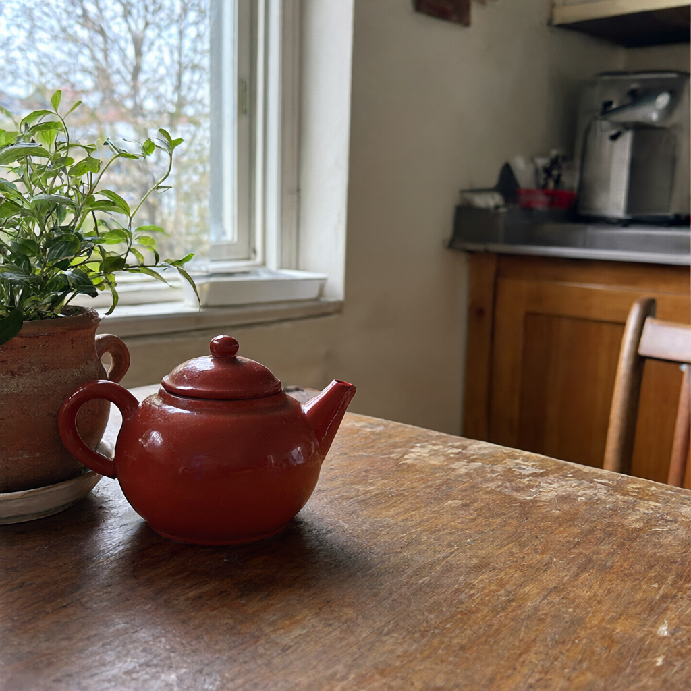

# Qwen-Image-2.1 GGUF на одной видеокарте

Отдельный гайд для **Q4_K_M** из
[abenzerps/Qwen-Image-2.1-Uncensored-GGUF](https://huggingface.co/abenzerps/Qwen-Image-2.1-Uncensored-GGUF).
В комплекте установщик, скачивание с проверкой SHA-256, 7 готовых ComfyUI
workflows и скрипт генерации через API.

[English](README.md) · [Задание агенту на английском](INSTALL-WITH-AGENT.md) · [Замеры и ограничения](docs/validation.md)

Цель этой версии: уменьшить требования к VRAM и дать варианты настройки для
разного железа. Файл Q4_K_M занимает 4,60 GB, но это **не полный расход памяти**.
Кроме генератора нужны текстовый энкодер, VAE и рабочие буферы. Экономные workflows
выносят энкодер на CPU и декодируют картинку частями. За это платим оперативной
памятью и временем.

В проверенном экономном режиме 1024 × 1024 процесс занял **6,14 GiB VRAM**.
Замер сделан на большой карте с ограниченным бюджетом размещения моделей,
поэтому это не гарантия для любой физической карты на 8 GB.

## Сколько памяти нужно

| Компонент | Файл | Размер на диске |
|---|---|---:|
| Генератор | `qwen-image-2.1-Q4_K_M.gguf` | 4,60 GB |
| Текстовый энкодер | `qwen3vl_8b_int8_convrot.safetensors` | 9,35 GB |
| VAE | `qwen_image_2.1_vae_bf16.safetensors` | 0,68 GB |
| Всего | 3 файла | 14,63 GB |

Здесь GB десятичные. Сам GGUF занимает примерно 4,29 GiB. Размер файла не
учитывает временные тензоры, деквантизацию, CUDA и декодирование картинки.

Для установки планируйте **45 GB свободного диска**, включая Python-пакеты и
кэш. Ориентир по RAM: **32 GB, лучше 64 GB с запасом**. Это рекомендация для
планирования, а не подтверждённый минимум: на машине с ограничением RAM в 32 GB
этот рецепт не тестировался. Фактические замеры приведены в
[отчёте](docs/validation.md).

Для незнакомой или небольшой видеокарты двигайтесь постепенно:

1. `07-small-512`: 512 × 512, текстовый энкодер на CPU, tiled VAE.
2. После успешной генерации попробуйте `06-low-vram` на 1024 × 1024.
3. Если памяти достаточно, попробуйте обычные workflows с device `default` у энкодера.
4. Нативный 2K проверяйте после успешного запуска меньшего разрешения.

### С какого профиля начать

Это рекомендации по нашим замерам, а не тесты каждой физической карты.

| VRAM | Стартовый профиль |
|---|---|
| 4 GB | Экспериментально: workflow 07, CPU encoder и CPU VAE, `--lowvram` |
| 6 GB | Workflow 07; при OOM декодирования перенесите VAE на CPU |
| 8–12 GB | Workflow 06, 1024 × 1024, CPU encoder и tiled VAE |
| 16 GB | Начните с 06; при запасе памяти попробуйте 01 с GPU encoder |
| 24 GB | Обычные workflows 01–05, включая проверенный 2K |

Самый экономный прогон дал 512 × 512 при **3,05 GiB VRAM** и **15,21 GiB RAM**
у процесса, за 195 секунд. На 3090 оставили бюджет размещения около 4 GiB.
Это основание попробовать физическую карту на 4 GB, но не гарантия для любой
такой карты. Для хоста с 16 GB RAM запаса под ОС практически не остаётся.

Команда агрессивного offload:

```bash
python3 install/setup.py launch --comfy "$HOME/ComfyUI-Qwen21-GGUF" --gpu 0 --port 8188 --lowvram --cpu-vae --fp32-text-enc --cpu-threads 16
```

Выберите workflow 07. Число CPU threads подберите под процессор.
**Не копируйте тестовый `--reserve-vram 16` или `20` на маленькую карту.**
Они использовались только для имитации меньшего бюджета на 24 GiB GPU.
Обычный резерв установщика составляет 1 GiB.

Обещания, что запустится на любой карте, здесь нет. Установщик рассчитан на
NVIDIA CUDA. Старым NVIDIA, AMD, Intel, Mac и CPU-only нужен подходящий backend
ComfyUI/PyTorch. Отдельно проверьте поддержку INT8 ConvRot энкодера: наличие GGUF
загрузчика само по себе её не гарантирует.

## Что именно скачиваем

Автор репозитория описывает модель как квантизацию исходных весов Qwen-Image-2.1.
Отдельный fine-tune или независимое изменение механизмов фильтрации мы не
подтверждали. `Uncensored` здесь название репозитория, а не результат теста.
Модель распространяется по Qwen Research License; условия находятся в
[репозитории весов](https://huggingface.co/abenzerps/Qwen-Image-2.1-Uncensored-GGUF).

GGUF уменьшает объём весов генератора. Это не обещание ускорения или полного
совпадения качества с BF16/INT8. [Исходный INT8-гайд](../qwen-image-2.1/README.ru.md)
остаётся отдельным вариантом установки.

## Установка с нуля: Linux / WSL2

Нужны Git, Python 3.10–3.13 и совместимый драйвер NVIDIA. Рекомендуется Python
3.12. На Ubuntu/Debian недостающие инструменты можно установить так:

```bash
sudo apt update
sudo apt install -y git python3 python3-venv
```

Проверьте `nvidia-smi`. Рабочий драйвер не нужно заменять ради инструкции.

```bash
git clone https://github.com/alesha-pro/tools.git
cd tools/qwen-image-2.1-gguf
python3 install/setup.py check
python3 install/setup.py install --dir "$HOME/ComfyUI-Qwen21-GGUF"
"$HOME/ComfyUI-Qwen21-GGUF/.venv/bin/python" install/download_models.py --models-dir "$HOME/ComfyUI-Qwen21-GGUF/models"
python3 install/setup.py launch --comfy "$HOME/ComfyUI-Qwen21-GGUF" --gpu 0 --port 8188 --lowvram
```

Откройте **http://127.0.0.1:8188**. Последняя команда работает в foreground,
поэтому терминал должен оставаться открытым. В `--gpu` укажите физический номер
нужной карты из `nvidia-smi`. Процесс увидит только эту карту.

Установщик создаёт отдельные checkout и venv, фиксирует версии ComfyUI,
[GGUF-ноды leejet](https://github.com/leejet/ComfyUI-GGUF) и основных пакетов.
Если установлен `uv`, используется он, иначе pip. Веса скачиваются отдельной
командой `download_models.py`. Чужую существующую установку установщик не меняет.
Версии указаны в [versions.json](install/versions.json).

## Windows PowerShell

Установите Git, Python 3.12 и подходящий драйвер NVIDIA:

```powershell
git clone https://github.com/alesha-pro/tools.git
cd tools/qwen-image-2.1-gguf
py -3.12 install/setup.py check
py -3.12 install/setup.py install --dir "$HOME/ComfyUI-Qwen21-GGUF"
& "$HOME/ComfyUI-Qwen21-GGUF/.venv/Scripts/python.exe" install/download_models.py --models-dir "$HOME/ComfyUI-Qwen21-GGUF/models"
py -3.12 install/setup.py launch --comfy "$HOME/ComfyUI-Qwen21-GGUF" --gpu 0 --port 8188 --lowvram
```

Команды Windows/WSL приведены для установки, но на этих платформах мы их не
проверяли. CUDA-установщик нельзя запускать прямо на macOS.

## Если ComfyUI уже установлен

Сначала проверьте `TextEncodeQwenImage21` и `UnetLoaderGGUF` в `/object_info`.
Не устанавливайте одновременно два форка с одинаковыми именами нод. Если ваш
форк уже поддерживает этот GGUF, его можно сохранить. Проверенная версия
находится в `install/versions.json`.

Если GGUF-ноды ещё нет, из корня существующего ComfyUI:

```bash
git clone https://github.com/leejet/ComfyUI-GGUF.git custom_nodes/ComfyUI-GGUF
git -C custom_nodes/ComfyUI-GGUF checkout f912d5e5c25921e41eae2c0131eeb4d350e7c165
.venv/bin/python -m pip install gguf==0.18.0 sentencepiece protobuf
```

Используйте настоящий Python этой установки. Если venv создан через uv и pip
в нём отсутствует:

```bash
uv pip install --python .venv/bin/python gguf==0.18.0 sentencepiece protobuf
```

Для Windows portable нода должна быть в `ComfyUI/custom_nodes/ComfyUI-GGUF`.
Пакеты устанавливаются из корня portable:

```powershell
.\python_embeded\python.exe -s -m pip install gguf==0.18.0 sentencepiece protobuf
```

Не обновляйте все зависимости вслепую. Если нет нативной Qwen 2.1 ноды,
обновите ComfyUI штатным способом или создайте отдельную установку. Дождитесь
пустой очереди перед перезапуском.

Из папки этого гайда скопируйте workflows:

```bash
python3 install/setup.py workflows --comfy /actual/path/to/ComfyUI
```

Замените путь на свой. Модели разложите по структуре ниже.

## Куда положить модели

```text
ComfyUI/
  models/
    diffusion_models/qwen-image-2.1-Q4_K_M.gguf
    text_encoders/qwen3vl_8b_int8_convrot.safetensors
    vae/qwen_image_2.1_vae_bf16.safetensors
```

`download_models.py` проверяет размеры и SHA-256 из
[models.json](install/models.json), умеет продолжать скачивание через Hugging
Face и отказывается перезаписывать файл с неправильной контрольной суммой.

Энкодер и VAE совпадают по SHA-256 с официальными файлами из INT8-гайда.
Если они уже скачаны, используйте их повторно. Для центрального хранилища
подойдёт `extra_model_paths.yaml`:

```yaml
qwen21_shared:
  base_path: /your/model/storage
  diffusion_models: diffusion_models
  text_encoders: text_encoders
  vae: vae
```

После изменения конфигурации перезапустите сервер. Загрузчик генератора теперь
`UnetLoaderGGUF`. Энкодер по-прежнему загружает стандартный `CLIPLoader` с типом
`qwen_image`; диффузионный GGUF нельзя подставить вместо него.

## Готовые workflows

Откройте боковую панель workflows, папку `qwen-image-2.1-gguf`. Также можно
перетащить UI JSON из `workflows/` на canvas. Папка `workflows/api/` содержит
другой формат для отправки через API.

| Workflow | Назначение |
|---|---|
| `01-text-to-image` | 1024 × 1024, 40 шагов, автоматическое размещение энкодера |
| `02-text-to-image-2k` | Нативные 2048 × 1152, 50 шагов |
| `03-image-edit` | Редактирование одной картинки |
| `04-transparent-rgba` | PNG с альфа-каналом |
| `05-two-reference-edit` | Редактирование по двум референсам |
| `06-low-vram` | 1024 × 1024, энкодер на CPU, tiled VAE |
| `07-small-512` | 512 × 512, проверка совместимости, CPU encoder и tiled VAE |

Промпт меняется в `TextEncodeQwenImage21`, размер T2I в `EmptyLatentImage`.
У KSampler стоят Euler/simple, CFG 1, denoise 1. Batch равен 1. Seed по умолчанию
меняется после генерации: `randomize`. Для повторения выберите `fixed`.
Одинаковый граф может попасть в кэш; это не новый замер скорости.

Для edit загрузите картинку и опишите, что изменить и что оставить.
Latent берётся из `TextEncodeQwenImage21`; resolution задаёт бюджет пикселей
с сохранением пропорций первого референса. Обращайтесь к картинкам через
`<image1>` и `<image2>`. Референсы требуют дополнительной памяти, поэтому сначала
проверьте обычный T2I.

Экономные workflows держат энкодер на CPU и декодируют VAE плитками 256 пикселей.
Если памяти всё равно мало, добавьте `--lowvram`, уменьшите разрешение либо
добавьте `--cpu-vae` при запуске. Перенос на CPU может заметно замедлить работу.
Уменьшение шагов экономит время, но не устраняет большой расход памяти внутри шага.

## Генерация через API

Из папки гайда:

```bash
"$HOME/ComfyUI-Qwen21-GGUF/.venv/bin/python" scripts/generate.py --mode small --seed 42 --out outputs
"$HOME/ComfyUI-Qwen21-GGUF/.venv/bin/python" scripts/generate.py --mode lowvram --seed 43 --out outputs
```

При достаточном запасе VRAM:

```bash
"$HOME/ComfyUI-Qwen21-GGUF/.venv/bin/python" scripts/generate.py --mode t2i --seed 44 --out outputs
"$HOME/ComfyUI-Qwen21-GGUF/.venv/bin/python" scripts/generate.py --mode 2k --seed 45 --out outputs
```

Свой промпт: `--prompt-file prompt.txt`. Другой сервер: `--url`. Если CPU медленный,
увеличьте ожидание через `--timeout 3600`. Для `--mode edit` нужен
`--image /actual/path/image.png`; для `references` ещё и `--reference`.

Скрипт проверяет очередь, отправляет `/prompt`, ждёт `/history/{prompt_id}`,
скачивает PNG через `/view` и проверяет декодирование и размеры. Рядом сохраняются
граф, seed, история и время. Откройте картинку и проверьте результат глазами.

## Если что-то не работает

- **Unknown architecture:** проверьте форк и версию GGUF-ноды. Правка одного
  `tools/convert.py` не является надёжным ремонтом runtime.
- **Модель не видна:** проверьте папку, имя, конфигурацию путей, SHA-256 и перезапуск.
- **OOM на промпте:** CLIPLoader device `cpu`, контроль свободной RAM.
- **OOM на сэмплинге:** меньше разрешение, batch 1, `--lowvram`.
- **OOM при декодировании:** tiled VAE или `--cpu-vae`.
- **Ошибка CUDA:** проверьте выбранный Python, PyTorch build и драйвер. Старое
  поколение NVIDIA может не поддерживаться закреплённой CUDA-сборкой.
- **Q8_0:** автор сообщает об ошибке размеров тензоров. Здесь проверяется Q4_K_M;
  успех одного формата не доказывает работу остальных.
- **Timeout клиента:** проверьте существующий prompt_id. Задача на сервере
  может продолжаться. Не отправляйте дубликаты и не завершайте чужие процессы.

Для удалённого сервера используйте SSH-туннель:

```bash
ssh -N -L 8188:127.0.0.1:8188 user@server
```

Если локальный порт занят, измените первое число. Не выставляйте ComfyUI без
авторизации в публичный интернет.

## Примеры

[Оригинальные PNG](examples/README.md): генерация, редактирование и прозрачный
объект.



## Источники

- [Репозиторий GGUF](https://huggingface.co/abenzerps/Qwen-Image-2.1-Uncensored-GGUF)
- [Проверенный код загрузчика](https://github.com/leejet/ComfyUI-GGUF/tree/f912d5e5c25921e41eae2c0131eeb4d350e7c165)
- [Официальная документация ComfyUI](https://docs.comfy.org/tutorials/image/qwen/qwen-image-2-1)
- [Исходный INT8-гайд](../qwen-image-2.1/README.ru.md)
