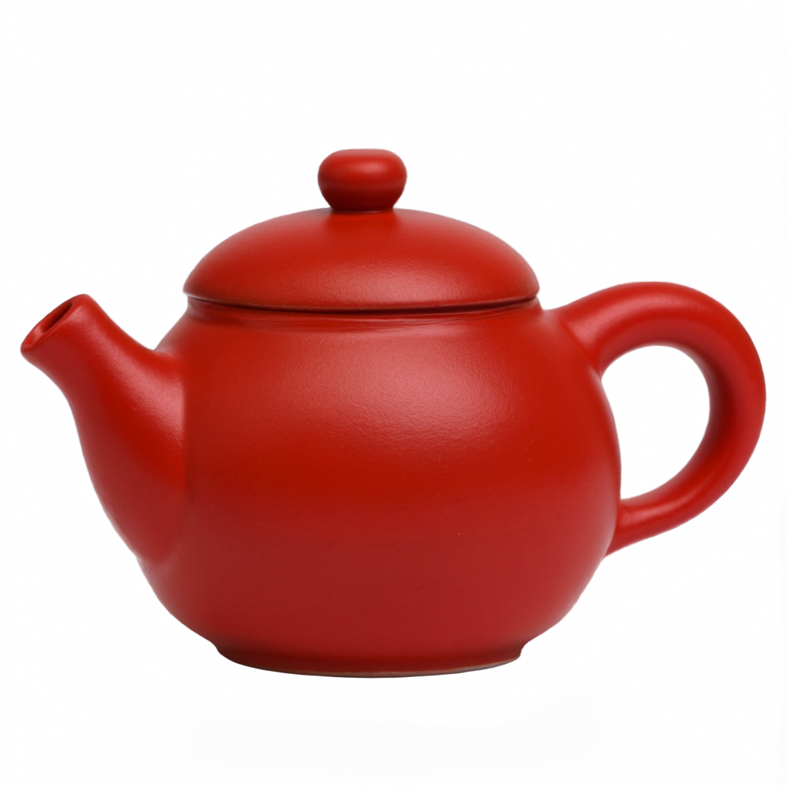

<div align="center">

# Qwen-Image-2.1 on one GPU

Local image generation, image editing and transparent PNGs in ComfyUI.
Five workflows, a separate-environment installer, verified model downloads,
and an installation brief you can hand to an agent.

[Русский гайд](README.ru.md) · [Agent instructions / Инструкция агенту](INSTALL-WITH-AGENT.md) · [Workflows](workflows/README.md)

</div>

## Start here

The baseline is **one NVIDIA GPU with 24 GB VRAM**, tested on an RTX 3090.
It uses official INT8 ConvRot weights for both the image model and text encoder,
plus the BF16 VAE. No custom nodes, ComfyUI Manager, paid API or prompt enhancer
are required by the supplied workflows.

The scripts target Linux and Windows with NVIDIA CUDA. The complete installation
verification is on Linux; Windows commands use the same Python scripts but are
not a separately tested Windows installation. This CUDA recipe does not cover
AMD, Intel or Apple GPUs.

Already have ComfyUI? Use [the existing-installation route](#existing-comfyui)
instead of installing dependencies over a working environment.

Want the agent to do it? Give it [INSTALL-WITH-AGENT.md](INSTALL-WITH-AGENT.md)
and this directory. That file includes the hardware audit, commands, acceptance
checks and boundaries for working on a shared machine.

## Checked examples

[Original PNGs and edit inputs](examples/README.md) from the clean installation test.

| T2I | Edit | RGBA |
|---|---|---|
|  |  |  |

## Hardware and disk

| Resource | Baseline / guidance |
|---|---|
| GPU | One RTX 3090 24 GB is validated. Other NVIDIA cards require their own smoke test. |
| 16 GB VRAM | Try 1024 × 1024, batch 1, CPU text encoder and `--lowvram`; not validated here. |
| Less VRAM | No fit or speed claim. Audit available offload before downloading the full set. |
| System RAM | 64 GB recommended for headroom; 32 GB may require offload tuning. The test host has 128 GB. |
| Storage | Models are 17.28 GB decimal / 16.10 GiB. Plan at least 45 GB free for models, runtime, caches and outputs. |
| Python | 3.10–3.13; 3.12 recommended. The clean Linux validation uses 3.10. |
| Driver | A recent NVIDIA driver supporting the chosen PyTorch CUDA runtime. Check `nvidia-smi` and `torch.cuda.is_available()`. |

Weights on disk are not peak VRAM. Activations, reference images, VAE decoding
and caches also consume memory. Start at 1 MP, then test your desired output size.
You do not need to compile CUDA kernels or install `nvcc` for this recipe.

## New installation: Linux / WSL2

On Windows with WSL2, install the NVIDIA Windows driver with WSL support; do not
install a second Linux display driver inside WSL. The following apt command is
for Ubuntu/Debian. Use your distribution's equivalents elsewhere.

```bash
sudo apt update
sudo apt install -y git python3 python3-venv

git clone https://github.com/alesha-pro/tools.git
cd tools/qwen-image-2.1
python3 install/setup.py check
python3 install/setup.py install --dir "$HOME/ComfyUI-Qwen21"
```

The installer creates a new checkout and `.venv`. It refuses to take over an
unrelated existing directory. If `uv` is on PATH it uses `uv`; otherwise it uses
`venv` and pip. It does not install system packages or change drivers.

Download the three model files into the new installation:

```bash
"$HOME/ComfyUI-Qwen21/.venv/bin/python" install/download_models.py \
  --models-dir "$HOME/ComfyUI-Qwen21/models"
```

The downloader pins a Hugging Face revision and verifies file size and SHA-256.
It skips already verified files. Interrupted downloads use Hugging Face's download
cache; rerun the same command. It refuses to overwrite an existing file with a
wrong checksum: move that file aside after investigating it.

Start ComfyUI and leave this terminal running:

```bash
python3 install/setup.py launch --comfy "$HOME/ComfyUI-Qwen21" --gpu 0
```

Open **http://127.0.0.1:8188**. Select a supplied workflow in
`user/default/workflows/qwen-image-2.1`, or drag a JSON from this package's
`workflows/` directory into the canvas. Enter a prompt and click Run.

`--gpu 0` means physical GPU 0. The launcher exposes only that card to ComfyUI;
inside the process it becomes `cuda:0`. On a shared machine, choose a free card
and an unused port, for example `--gpu 1 --port 8195`.

### Native Windows: PowerShell

Install Git, Python 3.12 and an NVIDIA driver first. Run these commands in
PowerShell, not CMD. Activating the virtual environment is unnecessary.

```powershell
git clone https://github.com/alesha-pro/tools.git
Set-Location tools/qwen-image-2.1
py -3.12 install/setup.py check
py -3.12 install/setup.py install --dir "$HOME/ComfyUI-Qwen21"
& "$HOME/ComfyUI-Qwen21/.venv/Scripts/python.exe" install/download_models.py --models-dir "$HOME/ComfyUI-Qwen21/models"
py -3.12 install/setup.py launch --comfy "$HOME/ComfyUI-Qwen21" --gpu 0
```

For Windows Portable or Desktop, follow the existing-installation route below;
the environment Python may be embedded or managed by the app. Do not run a
system `pip install` and expect it to update ComfyUI's Python.

## Existing ComfyUI

1. Back up workflows and note the current Git revision and Python environment.
2. Update through that installation's normal mechanism if
   `TextEncodeQwenImage21` is missing. This model needs native 2.1 support.
3. Download the files below into the model folders, or reuse central files with
   `extra_model_paths.yaml`. No duplicate weights are needed.
4. Copy workflows only:

```bash
python3 install/setup.py workflows --comfy /path/to/ComfyUI
```

This command does not install packages or alter ComfyUI code. It refuses to
replace a workflow whose contents you edited. You can also drag the JSON files
into an already running UI without copying them.

Use the actual ComfyUI Python to run the downloader. If it lacks
`huggingface_hub`, download with the direct links instead, or install the helper
in a separate small environment. Windows Portable's Python is commonly
`python_embeded/python.exe`, adjacent to its `ComfyUI` directory.

| File and target under `ComfyUI/models/` | Size | Download |
|---|---:|---|
| `diffusion_models/qwen_image_2.1_int8_convrot.safetensors` | 7.26 GB | [Official file](https://huggingface.co/Comfy-Org/Qwen-Image-2.1/resolve/b8abad01e16a50633160da778bec582b58761463/diffusion_models/qwen_image_2.1_int8_convrot.safetensors) |
| `text_encoders/qwen3vl_8b_int8_convrot.safetensors` | 9.35 GB | [Official file](https://huggingface.co/Comfy-Org/Qwen-Image-2.1/resolve/b8abad01e16a50633160da778bec582b58761463/text_encoders/qwen3vl_8b_int8_convrot.safetensors) |
| `vae/qwen_image_2.1_vae_bf16.safetensors` | 0.68 GB | [Official file](https://huggingface.co/Comfy-Org/Qwen-Image-2.1/resolve/b8abad01e16a50633160da778bec582b58761463/vae/qwen_image_2.1_vae_bf16.safetensors) |

Exact byte counts, hashes and revision are in [install/models.json](install/models.json).
For a central model directory, see [docs/operations.md](docs/operations.md).

## Verify the installation

With the server running, open a second terminal in this package directory:

```bash
"$HOME/ComfyUI-Qwen21/.venv/bin/python" scripts/generate.py \
  --mode t2i --seed 42 --out outputs
```

On Windows replace the Python path with `.venv/Scripts/python.exe` and run the
command on one line. `generate.py` checks model dropdowns, submits an API graph,
waits for its own history entry, downloads the PNG and decodes it with Pillow.
It writes `prompt.json`, `submission.json`, `history.json` and `result.json`
alongside the image. It refuses a busy queue unless you pass `--allow-queue`.

**Open the PNG.** A successful HTTP response or valid PNG does not establish
that the scene looks right. Then try 2K:

```bash
"$HOME/ComfyUI-Qwen21/.venv/bin/python" scripts/generate.py \
  --mode 2k --seed 43 --out outputs
```

Use a different seed for a real timing run; identical cached graphs can skip
sampling. A timeout does not cancel the server job. The script records its
`prompt_id`; inspect its history before resubmitting.

## Workflows and controls

| UI workflow | What to change |
|---|---|
| [01-text-to-image](workflows/01-text-to-image.json) | Prompt in TextEncodeQwenImage21; starts at 1024 square, 40 steps. |
| [02-text-to-image-2k](workflows/02-text-to-image-2k.json) | 2048 × 1152, 50 steps. Change width/height in EmptyLatentImage. |
| [03-image-edit](workflows/03-image-edit.json) | Upload one image and describe what changes and what stays. |
| [04-transparent-rgba](workflows/04-transparent-rgba.json) | Describe an isolated subject and explicitly request RGBA transparency. |
| [05-two-reference-edit](workflows/05-two-reference-edit.json) | Upload two images and identify their roles as `<image1>` and `<image2>`. |

Every workflow is a flat graph of native nodes. `KSampler` exposes the seed,
steps, CFG, sampler and scheduler. UI workflows default to **randomize** under
`control_after_generate`; choose **fixed** to keep a seed while changing a prompt.
The API client passes an explicit seed; it picks a random one when `--seed` is omitted.

Baseline: Euler, simple, CFG 1, denoise 1, batch 1. The included workflows use
40 steps at 1 MP and 50 at 2048 × 1152. Current official Comfy templates use
25 steps, while Qwen's reference examples use 40. More steps cost time and do
not guarantee a better image. Start with the included settings before tuning.

At CFG 1, the negative branch does not contribute standard classifier-free
guidance. Leave negative prompt empty. These workflows do not need a LoRA.

### Resolution: pixels, not a label

| Dimensions | Pixels | Use |
|---|---:|---|
| 1024 × 1024 | 1.05 MP | First test |
| 2048 × 1152 | 2.36 MP | Widescreen with 2048-pixel long edge |
| 1152 × 2048 | 2.36 MP | Portrait |
| 2048 × 2048 | 4.19 MP | 2K square, heavier than the widescreen preset |
| 2752 × 1536 | 4.23 MP | Approximately 4 MP wide output, also heavier |

Use multiples of 32. In text-to-image, `EmptyLatentImage` sets the output size.
In edit graphs, the `latent` output of `TextEncodeQwenImage21` goes directly to
KSampler. Its `resolution=1024` resizes the first reference to approximately
1 MP while preserving aspect ratio; it does not force a square or preserve
original pixel dimensions. `resolution=0` retains reference sizes rounded to
32, which can substantially increase memory use.

### Editing and alpha

For one reference: “Change the teapot in `<image1>` to cobalt blue. Keep its
shape, the plant, background, camera angle and lighting.” For two references,
state which supplies the composition and which supplies an object or color.
The same diffusion model handles generation and edits; denoise stays 1 in these
instruction-edit workflows. This is not the usual low-denoise img2img recipe.

The edit workflows include `QwenImage21Cache` at `auto/default`. Use `cpu` to
move reference cache pressure toward RAM if needed; start with its default
precision. Do not confuse this with a prompt enhancer.

RGBA output is native. Ask for an alpha channel and a transparent background,
and save as PNG. A gray checkerboard in the picture is not proof of transparency:
check that the PNG has an alpha channel with varying values. The `--mode rgba`
smoke test performs this check. Our edit examples use RGB references; preserving
alpha from an uploaded reference may need additional LoadImage/mask handling.

## Writing prompts

Describe the finished image in natural language: subject and action, setting,
composition, light, materials and the photographic or illustrative treatment.
A short precise prompt can work; extra adjectives do not guarantee realism.

For a realistic but impossible scene, give the unusual element a physical
relationship to familiar objects: scale markers, occlusion, reflections and
ordinary lighting. Example:

> A small neighborhood laundromat at night, photographed from the entrance.
> A dense rain cloud hangs below the ceiling and rains into a shallow puddle.
> A woman in rubber boots calmly reads beside the washing machines. Worn tile,
> detergent bottles, fluorescent light and dark wet windows. Realistic casual
> photography, no people reacting dramatically.

Keep quoted text exact when you want it rendered. For an edit, name both the
change and the features to preserve. Test one change at a time with a fixed seed.

## Prompt enhancer is optional

Qwen publishes dedicated [PE-T2I](https://huggingface.co/Qwen/Qwen-Image-2.1-PE-T2I)
and [PE-I2I](https://huggingface.co/Qwen/Qwen-Image-2.1-PE-I2I) rewriting models.
They are fine-tuned Qwen3.5-VL 9B models. T2I expands a text request and suggests
aspect ratio; I2I uses references and an editing instruction. Neither is the
text encoder loaded by ComfyUI's CLIPLoader.

The base installation does not download them. On one GPU, generate the rewritten
text first and release the enhancer's model memory before loading the image
pipeline. The official examples and system prompts are linked above. If you use
an enhancer, save both the user's text and the rewritten prompt for reproducibility.

## Speed and validation limits

Previous real runs on one RTX 3090, INT8 ConvRot, 2048 × 1152, Euler/simple,
CFG 1 and 50 steps took **82–96 seconds per completed ComfyUI job**. The two
road-scene reruns took 83.527 and 85.271 seconds. These are end-to-end server
history timings, not sampling-only timings or promises for every 24 GB card.
Those runs used the existing installation on a 128 GB host; some ran alongside
independent jobs on other GPUs. They are not a controlled hardware comparison.

The supplied package's separate installation and workflow checks are recorded
in [docs/validation.md](docs/validation.md). Windows and low-VRAM profiles are
not claimed to have the same test coverage.

## Troubleshooting and remote access

See [docs/operations.md](docs/operations.md) for missing nodes, memory pressure,
download verification, model paths, ports and SSH tunnels.

The fresh installer pins ComfyUI and a matching CUDA trio in
[install/versions.json](install/versions.json): Torch 2.11.0, torchvision 0.26.0
and torchaudio 2.11.0. ComfyUI imports audio code during startup even for image
workflows, so omitting torchaudio is not sufficient. Do not mix ABI-incompatible
versions merely because the image graph contains no audio nodes.

## Sources and license

Checked 2026-09-21:

- [Qwen official repository](https://github.com/QwenLM/Qwen-Image-2.1)
- [Official model card](https://huggingface.co/Qwen/Qwen-Image-2.1)
- [ComfyUI native workflow documentation](https://docs.comfy.org/tutorials/image/qwen/qwen-image-2-1)
- [Official ComfyUI model repack](https://huggingface.co/Comfy-Org/Qwen-Image-2.1)
- [ComfyUI installation documentation](https://github.com/Comfy-Org/ComfyUI#installing)
- [PyTorch installation selector](https://pytorch.org/get-started/locally/)

The scripts and authored workflows in this repository use its [MIT license](../LICENSE).
Model weights have their own **Qwen Research License**; see the
[model license](https://huggingface.co/Qwen/Qwen-Image-2.1/blob/main/LICENSE).
ComfyUI and its dependencies retain their respective licenses.
