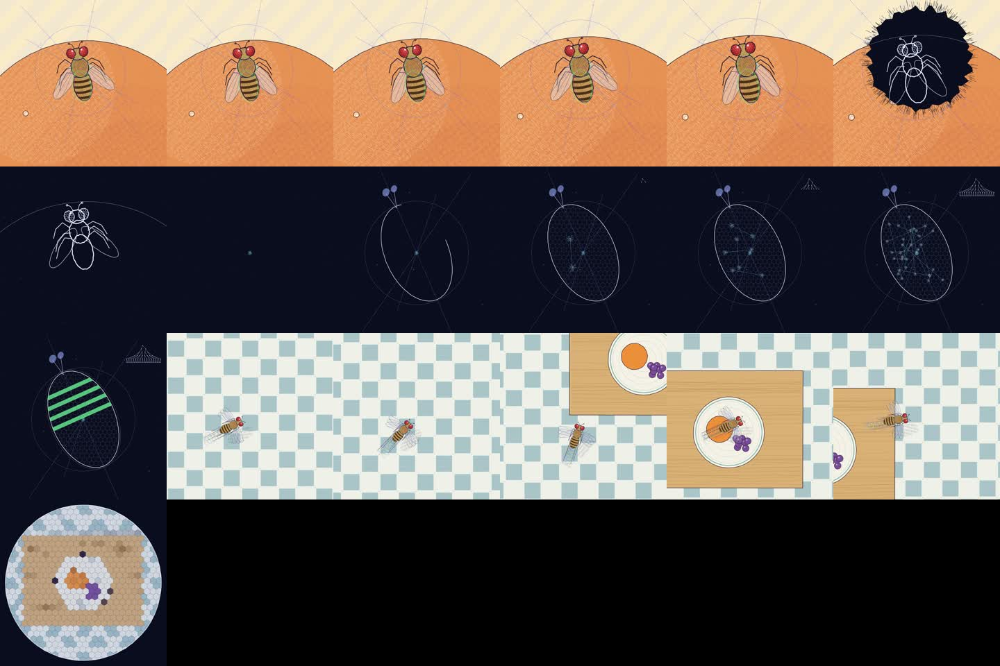
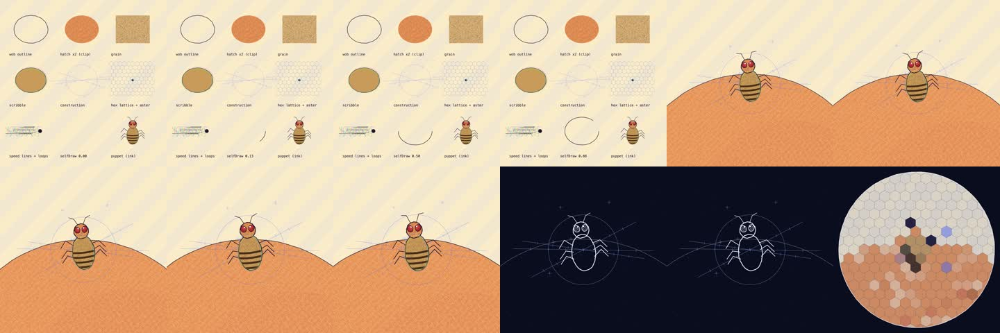

# hand-drawn-canvas-animation

An agent skill for making short films that look hand-drawn, where every frame
is drawn by JavaScript on a plain Canvas 2D. One HTML file, no images, no
libraries, no video model. A headless Chrome screenshots the frames, ffmpeg
packs them, and the same file writes the music from the same timeline, so
sound lands on the cuts.



The look comes from Kevin Ngo's
[The life of a fruit fly](https://x.com/kevin_t_ngo/status/2099858454043349342).
I measured the published video frame by frame and rebuilt the techniques as a
kit. It covers hatching clipped to shapes, grain, shaky outlines that never sit
exactly on their fills, misprinted colour outlines, blueprint guide lines, hex
lattices, ink-blot wipes, a compound-eye mosaic and a camera that leads the
subject. The reference is drawn at 12 fps and doubled to 24, the way cel
animation is shot on twos, and the kit keeps that cadence.

## Files

| path | what it is |
|---|---|
| [`SKILL.md`](SKILL.md) | the procedure the agent follows, the rules, the review checklist |
| [`assets/starter.html`](assets/starter.html) | the file you copy, with the drawing kit, a puppet, three demo scenes, timeline, score and player |
| [`examples/fly-style.html`](examples/fly-style.html) | a 9.5 s worked film with a peach, an ink blot, a dividing egg, a flight through a kitchen and a compound-eye view |
| [`scripts/render.mjs`](scripts/render.mjs) | frames, mp4 and contact sheet from one headless Chrome |
| [`references/style.md`](references/style.md) | twelve look rules and a table from plain words to kit calls |
| [`references/architecture.md`](references/architecture.md) | file layout, invariants, how to build a character, pitfalls |
| [`references/scenes.md`](references/scenes.md) | thirteen scene recipes, timing, score motifs |
| [`references/brief-template.md`](references/brief-template.md) | the brief the agent fills before writing code |
| [`references/reference-film.md`](references/reference-film.md) | measurements and a shot list of the reference film |

## Install

User scope:

```bash
cp -r hand-drawn-canvas-animation ~/.agents/skills/
```

If your agent reads skills from another directory, copy the folder there.
Project scope is `.agents/skills/` inside the repo you work in.

Rendering needs Node 18 or newer, Google Chrome or Chromium, and ffmpeg.
`puppeteer-core` drives the Chrome you already have and downloads nothing.

## Using it

Ask for a film and give it a subject:

> 20 seconds, the life of a request inside a GPU server, hand-drawn style.

The agent writes a beat sheet, builds the characters on a style sheet, draws
the scenes one at a time and checks each with single-frame renders, then does a
full render and fixes whatever the contact sheet shows. Rendering by hand:

```bash
mkdir my-film && cp hand-drawn-canvas-animation/assets/starter.html my-film/my-film.html
cp hand-drawn-canvas-animation/scripts/render.mjs hand-drawn-canvas-animation/scripts/package.json my-film/
cd my-film && npm i
node render.mjs my-film.html --only 0,30,68
node render.mjs my-film.html
```

The first render writes three PNGs to check. The second writes
`out/my-film.mp4` and `out/my-film-contact.jpg`. On an M4 Pro the 6 s starter
renders in about 5 seconds and the 9.5 s example in about 7. A frame
that throws is reported with its number and time, and then no mp4 is built.

Open the HTML file directly in a browser to scrub, play with sound, and export
`score.wav`. Mux it with:

```bash
ffmpeg -i out/my-film.mp4 -i score.wav -c:v copy -c:a aac -shortest out/my-film-final.mp4
```


